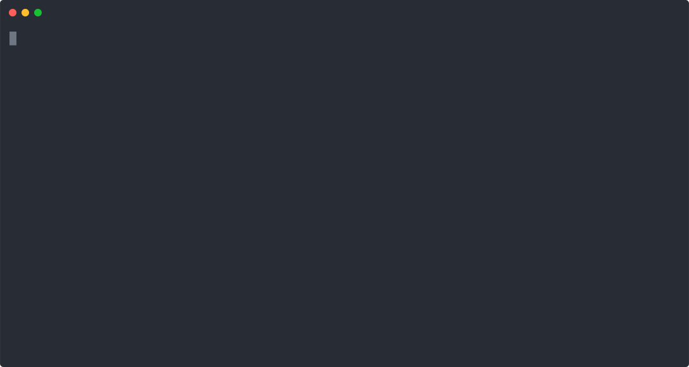

# Hexlet frontend project

## Brain Games
### CLI app for brain training

[](https://codeclimate.com/github/it-amalker/frontend-project-lvl1/maintainability)
[](https://travis-ci.com/it-amalker/frontend-project-lvl1)

### Install game packages
#### First of all need to:
* [Clone](https://help.github.com/en/github/using-git/which-remote-url-should-i-use#cloning-with-https-urls-recommended) [this](https://github.com/it-amalker/frontend-project-lvl1.git) repository
* Install [Node Version Manager (NVM)](https://github.com/nvm-sh/nvm#install--update-script)
* Install [Node.js](https://github.com/nvm-sh/nvm#usage) with nvm:
```
$ nvm install node
```
* Run these commands from cloned brain games directory:
```
$ make install
$ make publish
$ npm link
```
[](https://asciinema.org/a/294779)
### Choose the game from menu and start to play
```
$ brain-games
```

### Brain Game #1. Even game
#### Try to guess, is number even or not

[](https://asciinema.org/a/294765)

### Brain Game #2. Calculation game
#### Try to calculate the expression

[](https://asciinema.org/a/294790)

### Brain Game #3. Greatest common divisor game 
#### Find greatest common divisor

[](https://asciinema.org/a/294795)

### Brain Game #4. Progression game 
#### Find number, which is missing in the progression

[](https://asciinema.org/a/294797)

### Brain Game #5. Prime game 
#### Find out is given number is prime

[](https://asciinema.org/a/294799)